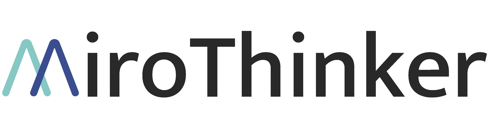
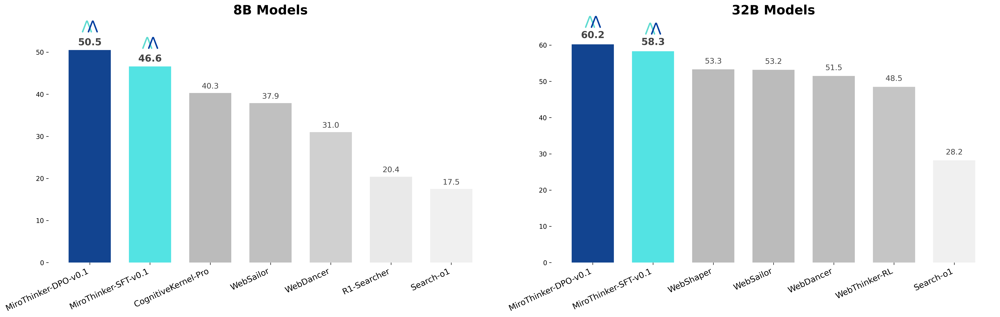

# MiroFlow: Open Agent Development Framework

<div align="center">
  
</div>
<!-- <hr> -->
<div align="center">

[](https://dr.miromind.ai/)
[](https://huggingface.co/collections/miromind-ai/mirothinker-v01-689301b6d0563321862d44a1)
[](https://huggingface.co/datasets/miromind-ai/MiroVerse-v0.1)
[](https://github.com/MiroMindAI/MiroFlow/tree/mirothinker)
[](https://miromind.ai/)
[](https://discord.com/invite/EprKHYcm)

</div>

**MiroFlow** = **MiroThinker** + **Agent Workflow**

> **⚠️ Branch Notice**: This is the **MiroFlow-MiroThinker** branch for MiroThinker models. For general use cases, see the `main` branch.

A comprehensive framework for building, testing, and deploying intelligent agents powered by MiroThinker models with multi-turn conversation capabilities and advanced tool integration.


## 📰 News & Updates

- **2025-08-08**: 🎉 **MiroFlow v0.1 Released** - Framework, models, and data collection now fully open-source

## 🎯 Overview

MiroFlow is a framework for agent development that supports various language models and provides a comprehensive framework for building intelligent agents. The framework includes enhanced conversation management, flexible tool integration, and extensive benchmark evaluations across multiple datasets.

## ✨ Key Features

### 🤖 **MiroThinker-Optimized Agent Framework**
- **Fully Open-Source Agent Framework**: Complete transparency with open framework, open models, and open data collection.
- **Tool Integration**: Seamless integration with external tools and APIs
- **Trace Collection**: Comprehensive logging and analysis of agent interactions with elapsed time and estimated completion time displayed in minutes. Ready for supervised fine-tuning or DPO.
- **Benchmark Evaluation**: Extensive testing across multiple benchmark datasets

### 📊 **Comprehensive Benchmark Suite**
- **GAIA Validation**: A benchmark for General AI Assistants. ([paper](https://arxiv.org/abs/2311.12983)).
- **GAIA-Text-103**: A subset of GAIA Validation for text-only tasks. ([paper](https://arxiv.org/abs/2505.22648))
- **HLE**: Humanity's Last Exam. ([paper](https://arxiv.org/abs/2501.14249))
- **HLE-Text-500**: A subset of HLE for text-only tasks. ([paper](https://arxiv.org/pdf/2504.21776))
- **BrowseComp**: Web browsing and comprehension tasks. ([paper](https://arxiv.org/abs/2504.12516))
- **WebWalkerQA**: Web navigation and question answering. ([paper](https://arxiv.org/abs/2501.07572))
- **Frames**: Factuality, Retrieval, And reasoning MEasurement Set. ([paper](https://arxiv.org/abs/2409.12941))


## 🚀 Quick Start

### Prerequisites

- Python 3.10+
- [uv](https://docs.astral.sh/uv/) package manager
- Required API keys (see Configuration section)

### Installation

1. **Clone the repository**
```bash
git clone https://github.com/MiroMindAI/MiroFlow.git
cd MiroFlow
git checkout mirothinker
```

2. **Download benchmark data**
```bash
wget https://huggingface.co/datasets/miromind-ai/MiroFlow-Benchmarks/resolve/main/data_20250808.zip
unzip data_20250808.zip
rm data_20250808.zip
```

3. **Set up environment**
```bash
# Shift working dir
cd apps/miroflow-agent
# Install environment
uv sync
# Create .env file with your API keys
cp .env.example .env
# Edit .env with your actual API keys
```

Create a `.env` file in the `apps/miroflow-agent` directory:

```bash
# Required APIs
SERPER_API_KEY=your_serper_key
E2B_API_KEY=your_e2b_key
ANTHROPIC_API_KEY=your_anthropic_key
OPENAI_API_KEY=your_openai_key

# Future APIs (Please use dummy values for now)
GEMINI_API_KEY=your_gemini_key
JINA_API_KEY=your_jina_key
FIRECRAWL_API_KEY=your_firecrawl_key
SILICONFLOW_API_KEY=your_siliconflow_key
```

### Serve the MiroThinker Model

Use SGLang to serve MiroThinker models at port 61002:
```
PORT=61002
MODEL_PATH=miromind-ai/MiroThinker-32B-DPO-v0.1

export CUDA_VISIBLE_DEVICES=0,1,2,3,4,5,6,7
python3 -m sglang.launch_server \
    --model-path $MODEL_PATH \
    --tp 8 \
    --dp 1 \
    --host 0.0.0.0 \
    --port $PORT \
    --trust-remote-code \
    --log-level debug \
    --log-level-http debug \
    --log-requests \
    --log-requests-level 2 \
    --attention-backend flashinfer \
    --enable-metrics \
    --show-time-cost \
    --chat-template assets/qwen3_nonthinking.jinja
```
This will start a server at: `http://0.0.0.0:61002`. Use this as your server base URL.

### Basic Usage

1. **Run a single evaluation**
```bash
cd apps/miroflow-agent
uv run main.py llm=qwen3-32b agent=evaluation llm.openai_base_url=https://your-api.com/v1
```

2. **Run comprehensive benchmark evaluation**
```bash
# GAIA-Validation
bash scripts/run_evaluate_multiple_runs_gaia-validation.sh

# GAIA-Validation-Text-103
bash scripts/run_evaluate_multiple_runs_gaia-validation-text-103.sh

# WebWalkerQA
bash scripts/run_evaluate_multiple_runs_webwalkerqa.sh

# HLE
bash scripts/run_evaluate_multiple_runs_hle.sh

# HLE-Text-500
bash scripts/run_evaluate_multiple_runs_hle-text-500.sh

# FRAMES
bash scripts/run_evaluate_multiple_runs_frames.sh

# BrowseComp
bash scripts/run_evaluate_multiple_runs_browsecomp.sh
```

3. **Monitor evaluation progress**
```bash
# For GAIA validation
python benchmarks/evaluators/check_progress_gaia-validation.py /path/to/evaluation/logs

# For GAIA-Text-103
python benchmarks/evaluators/check_progress_gaia-validation-text-103.py /path/to/evaluation/logs

# Others follow the same pattern
```

## 🛠️ (Optional) Using Open-Source Tools

We also provide the option to use open-source tools as alternatives to proprietary models and tools. For detailed setup and configuration instructions, please refer to our documentation: [USE-OS-TOOL.md](assets/USE-OS-TOOL.md).

## 📈 Benchmark Evaluation
<div align="center">
  
  <p><strong>Performance of MiroFlow on GAIA-Validation Benchmark</strong></p>
</div>

For comprehensive evaluation results and detailed performance metrics, please refer to our model card at [MiroThinker Model Card](https://huggingface.co/collections/miromind-ai/mirothinker-v01-689301b6d0563321862d44a1).


## 📊 Trace Collection

The trace collection scripts automatically save logs in the `logs/` directory in `chatml` format.

```bash
cd apps/collect-trace

# Collect Claude Traces for Imitation Learning - SFT
bash scripts/run_benchmark_claude.sh

# Collect MitoThinker Traces for DPO purposes
bash scripts/run_benchmark_qwen.sh
```

## 📄 License

This project is licensed under the Apache License 2.0 - see the [LICENSE](LICENSE) file for details.

## 🙏 Acknowledgments

- **Benchmark Contributors** for the comprehensive evaluation datasets
- **Open Source Community** for the tools and libraries that make this possible

## 📞 Support

- **Issues**: For questions or bug reports, please use [GitHub Issues](https://github.com/MiroMindAI/MiroFlow/tree/mirothinker) and include the tag `[Question-MiroThinker]` when referring to this branch.
- **QA Documentation**: See [QA.md](assets/QA.md) for additional guidelines
